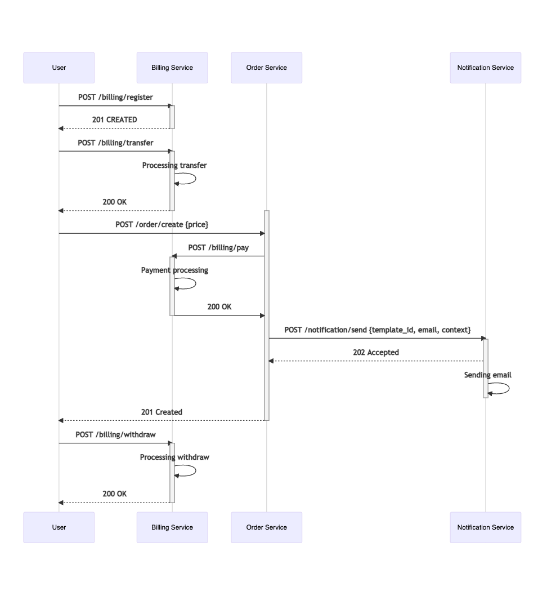
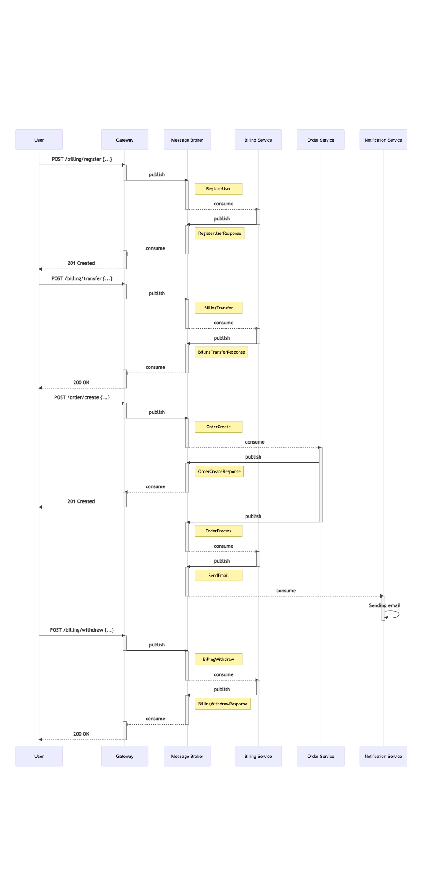
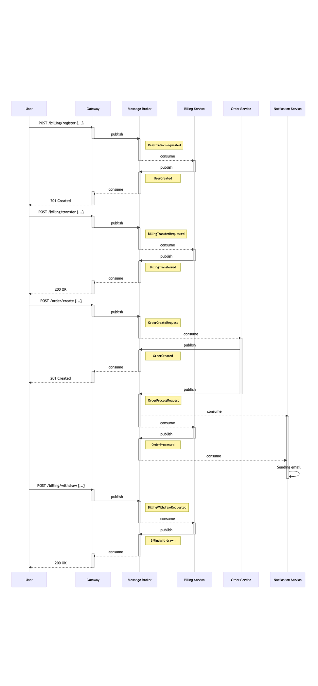

## Сценарий:

- Пользователь заходит на страницу регистрации. 
- Пользователь вводит в форму регистрации идентификационные данные и почту. 
- Пользователь нажимает на кнопку "Регистрация"
- Создается аккаунт пользователя в сервисе биллинга.
- Пользователю показывается информация об успешной регистрации. 
- Пользователь перечисляет деньги на свой аккаунт.
- Пользователь создает заказ, указывая цену.
- Снятие денег с аккаунта пользователя в сервисе биллинга.
- Отправка сообщения пользователю на почту с результатом оформления заказа.
- Пользователь может снимать деньги с аккаунта.

## RESTful

[Описание REST интерфейсов](http://petstore.swagger.io/?url=https%3A%2F%2Fraw.githubusercontent.com%2Fmnv%2Fstream-processing-api-spec%2Fmaster%2Frestful%2Frest-openapi.yaml)

## RPC over Message Bus

[Описание ASYNC интерфейсов](./message-bus/bus-asyncapi.yaml)

## Event Collaboration

[Описание ASYNC интерфейсов](./event-collab/collab-asyncapi.yaml)

