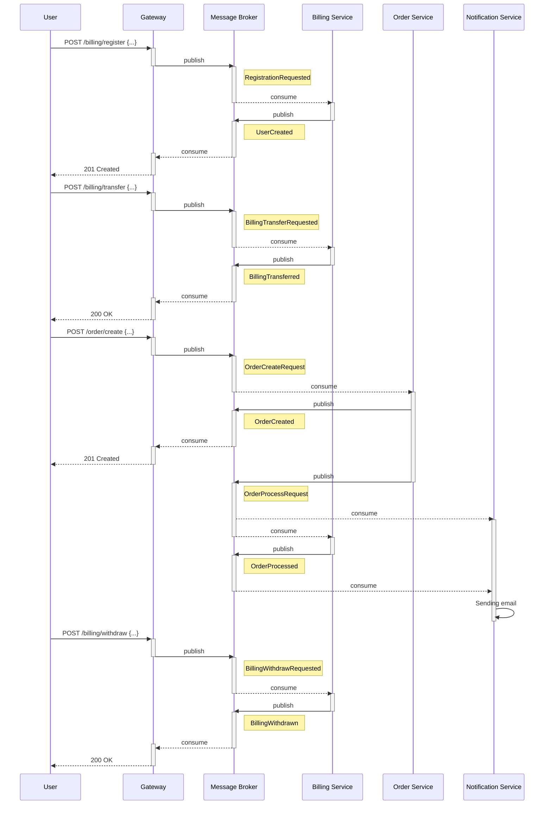

```mermaid
sequenceDiagram
participant User
participant Gateway
participant Message Broker
participant Billing Service
participant Order Service
participant Notification Service

User->>+Gateway: POST /billing/register {...}
Gateway->>-Message Broker:  publish
activate Message Broker
Note right of Message Broker: RegistrationRequested
Message Broker -->> Billing Service: consume
deactivate Message Broker
activate Billing Service
Billing Service->>Message Broker: publish
deactivate Billing Service
activate Message Broker
Note right of Message Broker: UserCreated
Message Broker -->>+ Gateway: consume
deactivate Message Broker
Gateway -->>- User: 201 Created

User->>+Gateway: POST /billing/transfer {...}
Gateway->>-Message Broker:  publish
activate Message Broker
Note right of Message Broker: BillingTransferRequested
Message Broker -->> Billing Service: consume
deactivate Message Broker
activate Billing Service
Billing Service->>Message Broker: publish
deactivate Billing Service
activate Message Broker
Note right of Message Broker: BillingTransferred
Message Broker -->>+ Gateway: consume
deactivate Message Broker
Gateway -->>- User: 200 OK

User->>+Gateway: POST /order/create {...}
Gateway->>-Message Broker:  publish
activate Message Broker
Note right of Message Broker: OrderCreateRequest
Message Broker -->> Order Service: consume
deactivate Message Broker
activate Order Service
Order Service->>Message Broker: publish
activate Message Broker
Note right of Message Broker: OrderCreated
Message Broker -->>+ Gateway: consume
deactivate Message Broker
Gateway -->>- User: 201 Created

Order Service->>Message Broker: publish
deactivate Order Service
activate Message Broker
Note right of Message Broker: OrderProcessRequest
Message Broker -->> Notification Service: consume
activate Notification Service
Message Broker -->> Billing Service: consume
deactivate Message Broker
activate Billing Service
Billing Service->>Message Broker: publish
deactivate Billing Service
activate Message Broker
Note right of Message Broker: OrderProcessed
Message Broker -->> Notification Service: consume
deactivate Message Broker
Notification Service ->> Notification Service: Sending email
deactivate Notification Service

User->>+Gateway: POST /billing/withdraw {...}
Gateway->>-Message Broker:  publish
activate Message Broker
Note right of Message Broker: BillingWithdrawRequested
Message Broker -->> Billing Service: consume
deactivate Message Broker
activate Billing Service
Billing Service->>Message Broker: publish
deactivate Billing Service
activate Message Broker
Note right of Message Broker: BillingWithdrawn
Message Broker -->>+ Gateway: consume
deactivate Message Broker
Gateway -->>- User: 200 OK
```
