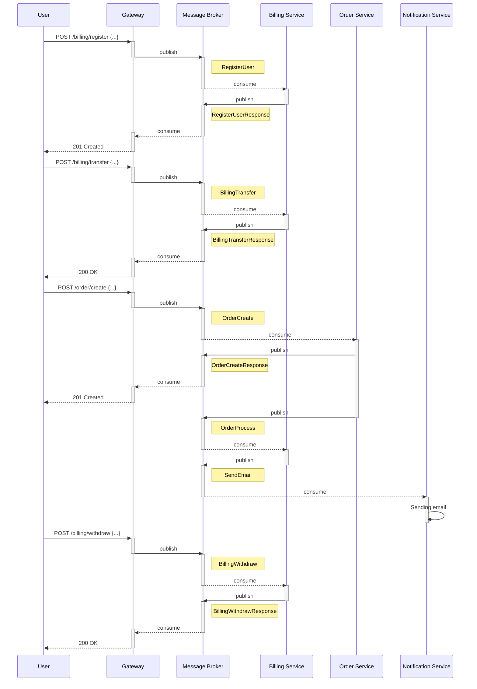

```mermaid
sequenceDiagram
participant User
participant Gateway
participant Message Broker
participant Billing Service
participant Order Service
participant Notification Service

User->>+Gateway: POST /billing/register {...}
Gateway->>-Message Broker:  publish
activate Message Broker
Note right of Message Broker: RegisterUser
Message Broker -->> Billing Service: consume
deactivate Message Broker
activate Billing Service
Billing Service->>Message Broker: publish
deactivate Billing Service
activate Message Broker
Note right of Message Broker: RegisterUserResponse
Message Broker -->>+ Gateway: consume
deactivate Message Broker
Gateway -->>- User: 201 Created


User->>+Gateway: POST /billing/transfer {...}
Gateway->>-Message Broker:  publish
activate Message Broker
Note right of Message Broker: BillingTransfer
Message Broker -->> Billing Service: consume
deactivate Message Broker
activate Billing Service
Billing Service->>Message Broker: publish
deactivate Billing Service
activate Message Broker
Note right of Message Broker: BillingTransferResponse
Message Broker -->>+ Gateway: consume
deactivate Message Broker
Gateway -->>- User: 200 OK

User->>+Gateway: POST /order/create {...}
Gateway->>-Message Broker:  publish
activate Message Broker
Note right of Message Broker: OrderCreate
Message Broker -->> Order Service: consume
deactivate Message Broker
activate Order Service
Order Service->>Message Broker: publish
activate Message Broker
Note right of Message Broker: OrderCreateResponse
Message Broker -->>+ Gateway: consume
deactivate Message Broker
Gateway -->>- User: 201 Created

Order Service->>Message Broker: publish
deactivate Order Service
activate Message Broker
Note right of Message Broker: OrderProcess
Message Broker -->> Billing Service: consume
deactivate Message Broker
activate Billing Service
Billing Service->>Message Broker: publish
deactivate Billing Service
activate Message Broker
Note right of Message Broker: SendEmail
Message Broker -->> Notification Service: consume
deactivate Message Broker
activate Notification Service
Notification Service ->> Notification Service: Sending email
deactivate Notification Service

User->>+Gateway: POST /billing/withdraw {...}
Gateway->>-Message Broker:  publish
activate Message Broker
Note right of Message Broker: BillingWithdraw
Message Broker -->> Billing Service: consume
deactivate Message Broker
activate Billing Service
Billing Service->>Message Broker: publish
deactivate Billing Service
activate Message Broker
Note right of Message Broker: BillingWithdrawResponse
Message Broker -->>+ Gateway: consume
deactivate Message Broker
Gateway -->>- User: 200 OK
```
